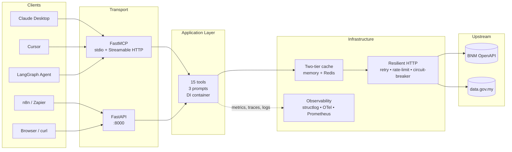
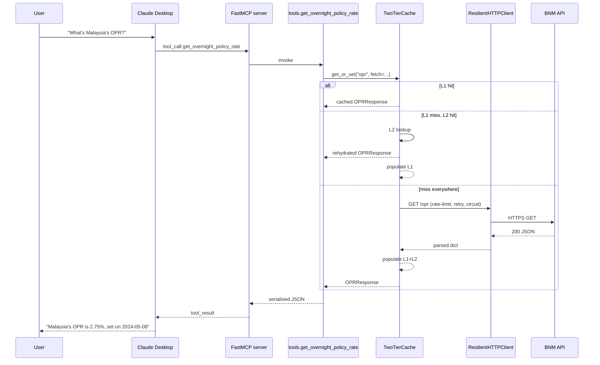

# Architecture

## High level



## Layered structure

```
src/malaysia_data_mcp/
├── domain/                          # zero deps; types only
│   ├── models.py                    # Pydantic v2 response models
│   └── errors.py                    # exception hierarchy
│
├── infrastructure/                  # outward adapters
│   ├── settings.py                  # 12-factor config
│   ├── observability.py             # structlog + OTel + Prometheus
│   ├── cache.py                     # 2-tier TTL cache + stampede protection
│   ├── http.py                      # httpx + tenacity + aiolimiter + circuit
│   └── clients/
│       ├── bnm.py                   # 8 BNM endpoints
│       └── datagovmy.py             # 5 data.gov.my datasets
│
├── application/                     # business logic
│   ├── container.py                 # DI container
│   ├── tools.py                     # 15 tools (pure async, MCP-agnostic)
│   └── prompts.py                   # 3 prompt templates
│
└── presentation/                    # inward adapters
    ├── mcp_server.py                # FastMCP wiring
    └── http_server.py               # FastAPI wiring
```

See [ADR-0007](./adr/0007-hexagonal-architecture.md) for the rationale.

## Request flow — example: Claude Desktop asks "what's the current OPR?"



## Failure modes

| Mode | What happens | Caller sees |
|---|---|---|
| BNM 5xx | retry up to N×, then circuit opens | `503 + Retry-After` (REST) / `ToolError(circuit_open)` (MCP) |
| BNM timeout | tenacity retries with exponential backoff | latency spike, eventually `502` if persists |
| Schema drift | Pydantic raises `ValidationError` → `UpstreamInvalidResponse` | `502 upstream_invalid_response` |
| Rate limit hit (local) | aiolimiter waits | latency spike, no error |
| Redis down | L2 silently falls back | warning log, increased upstream load |
| Bad input | FastAPI/Pydantic 422 / MCP schema rejection | `400` with field-level error |

## Configuration via environment variables

All settings prefixed `MALAYSIA_DATA_*`. See `infrastructure/settings.py` for
the full list. Common ones:

| Variable | Default | Purpose |
|---|---|---|
| `MALAYSIA_DATA_ENVIRONMENT` | `dev` | dev / staging / prod |
| `MALAYSIA_DATA_LOG_LEVEL` | `INFO` | DEBUG / INFO / WARNING / ERROR |
| `MALAYSIA_DATA_LOG_JSON` | `true` | structured vs human-readable logs |
| `MALAYSIA_DATA_CACHE_REDIS_URL` | _(unset)_ | enables L2 cache |
| `MALAYSIA_DATA_OTEL_ENABLED` | `false` | turn on tracing |
| `MALAYSIA_DATA_OTEL_ENDPOINT` | _(unset)_ | OTLP HTTP endpoint |
| `MALAYSIA_DATA_HTTP_PORT` | `8000` | REST server bind port |
